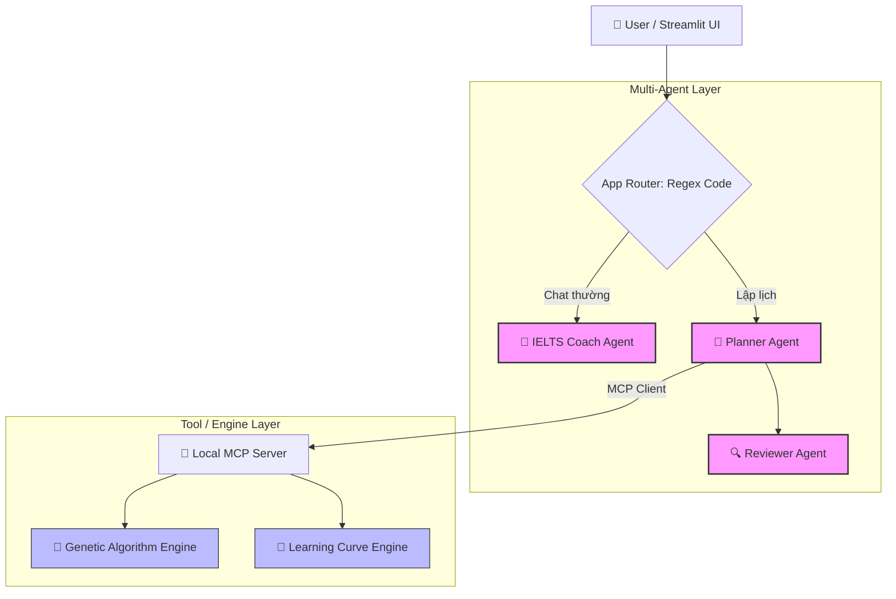

# Codebase Map

Generated: 2026-06-30T17:22:00+07:00

## Module Boundaries

| Module | Directory | Public API | Dependencies | Domain |
| :--- | :--- | :--- | :--- | :--- |
| **Agent Rules** | `.agent/rules/` | Quy tắc Rune cho Agent (onboard, cook, scout...) | none | Quy ước & hướng dẫn hoạt động của AI Agent |
| **Documentation** | `docs/` | agno_agent_lessons, cookbook, os_architecture | none | Hướng dẫn Framework & các kiến trúc mẫu |
| **System Designs** | (Root) | system_design_v3.md, system_design_multi_agent.md | Specs | Phân tích kiến trúc hệ thống và luồng dữ liệu |
| **Specifications** | (Root) | Specs-5565918f-f1cf-5191-bbb5-e43fc8cbf30d.md | none | Đặc tả các mô hình toán học (GA, fatigue, learning curve) |

## Dependency Graph (Mermaid)

## Domain Ownership

| Domain | Modules | Key Files |
| :--- | :--- | :--- |
| **Agent Orchestration** | Agno Agents | `system_design_v3.md`, `system_design_multi_agent.md` |
| **Optimization Engine** | Math/GA Engines | `Specs-5565918f-f1cf-5191-bbb5-e43fc8cbf30d.md` |
| **System Evaluation** | Research/Paper | `project_evaluation.md`, `Capstone Project.docx.md` |
| **Agent Standard Rules** | Rune Kit | `.agent/rules/rune-onboard.md`, `CLAUDE.md` |
