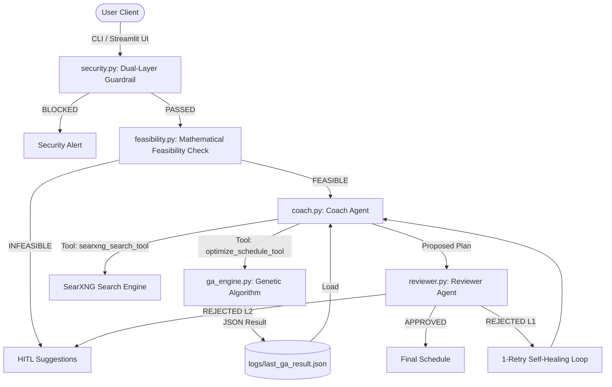

# System Architecture: IELTS Study Coach Agent

This document describes the technical architecture, design decisions, component interactions, and data flow of the IELTS Study Coach multi-agent system.

---

## 1. Overview & Key Decisions

| Decision | Rationale |
|:---|:---|
| **Deterministic Workflow Pipeline** | Explicit `workflow.py` coordinator over ad-hoc LLM routing — ensures predictable execution order and debuggable failure modes |
| **Decoupled GA Engine** | Pure Python/NumPy optimizer in `ga_engine.py` — zero LLM latency for mathematical computation |
| **Modular Agent Package** | Separate files under `ielts_coach/agents/` (Coach, Reviewer, Security, Base) — clear separation of concerns for maintainability |
| **Pre-computation Feasibility** | Mathematical validation before any LLM/GA invocation — saves API costs on impossible targets |
| **Dual-Layer Security** | Regex + LLM semantic filter — fast/cheap first pass, deep analysis second pass |
| **1-Retry Self-Healing + HITL** | Automatic recovery on reviewer rejection; user-guided fallback prevents silent bad output |
| **Adaptive Model Factory** | `get_model()` supports Gemini direct, LiteLLM proxy, and OpenAI fallback — deployment flexibility |
| **Exponential Backoff Retry** | `run_agent_with_retry()` wraps all LLM calls — transparent 503/429 handling |

---

## 2. Component Diagram



---

## 3. Module Map

### Core Package (`ielts_coach/`)

| Module | LOC | Purpose |
|:---|:---|:---|
| `ga_engine.py` | 339 | Genetic Algorithm: population generation, tournament selection, single-point crossover, mutation, fitness evaluation with learning curves + fatigue |
| `feasibility.py` | 83 | Inverted learning curve calculator; validates that required study hours ≤ available hours before GA runs |
| `workflow.py` | 319 | `execute_study_plan_flow()` — the 5-stage pipeline coordinator with retry logic, step metadata, and mock scenario routing |
| `mcp_server.py` | 37 | FastMCP stdio server exposing `optimize_schedule` tool for external MCP clients |
| `mock_data.py` | 297 | 5 high-fidelity demo scenarios with realistic logs, step metadata, and GA result payloads |

### Agent Sub-Package (`ielts_coach/agents/`)

| Module | LOC | Purpose |
|:---|:---|:---|
| `base.py` | 91 | `get_model()` adaptive factory (Gemini/LiteLLM/OpenAI); `run_agent_with_retry()` with exponential backoff; `is_json_error()` provider error detection |
| `coach.py` | 119 | `CoachAgent` definition + 2 registered tools: `optimize_schedule_tool` (GA wrapper) and `searxng_search_tool` (web search via SearXNG). Thread-safe tool-call state tracking |
| `reviewer.py` | 28 | `ReviewerAgent` definition — pedagogical critic that returns `APPROVED` or `REJECTED` verdicts |
| `security.py` | 101 | `check_rule_based()` regex filter + `SecurityGuardrailAgent` LLM semantic check; `validate_user_prompt()` orchestrates both layers |

### Application Layer

| Module | LOC | Purpose |
|:---|:---|:---|
| `app.py` | 493 | Streamlit web UI: dark theme, sidebar sliders, Agent Execution Timeline badges, Matplotlib charts, color-coded log viewer |
| `cli.py` | 258 | Rich CLI: interactive chat, parameter flags, demo mode selector, trace log streaming |
| `simulation.py` | 113 | 100-user quantitative simulation: randomized profiles, success rate, band improvement metrics |

---

## 4. Data Flow: Request Lifecycle

```
     User Input (CLI / Streamlit)
                  │
                  ▼
     ┌── validate_user_prompt() ──┐
     │   Layer 1: Regex filter    │
     │   Layer 2: LLM semantic    │
     └────────────┬───────────────┘
         ┌────────┴────────┐
         ▼                 ▼
     [BLOCKED]          [PASSED]
   Return Alert     check_feasibility()
                         │
              ┌──────────┴──────────┐
              ▼                     ▼
         [INFEASIBLE]           [FEASIBLE]
       Return HITL          get_coach_agent()
       suggestions          run_agent_with_retry()
                                    │
                                    ▼
                           was_tool_called()?
                                    │
                        ┌───────────┴───────────┐
                        ▼                       ▼
                   [NO: Chat]            [YES: Schedule]
                  Return response     get_reviewer_agent()
                                     run_agent_with_retry()
                                            │
                                 ┌──────────┴──────────┐
                                 ▼                     ▼
                            [APPROVED]             [REJECTED]
                          Return schedule       Feed feedback →
                                               Re-run Coach Agent
                                                       │
                                            ┌──────────┴──────────┐
                                            ▼                     ▼
                                       [APPROVED]           [REJECTED ×2]
                                      Return revised       Escalate to HITL
                                        schedule           with math suggestions
```

---

## 5. Security Architecture

```
Input ──► [Layer 1: Regex]          ──► BLOCK (if injection pattern matched)
      │                                     ↓ PASS
      └──► [Layer 2: LLM Agent]     ──► BLOCK (if !is_safe || !is_relevant)
                                           ↓ PASS
                                    ──► Continue to Feasibility Check
```

- **Layer 1** uses a compiled regex pattern (`INJECTION_PATTERN`) to catch known prompt injection keywords. Zero API cost, microsecond latency.
- **Layer 2** invokes `SecurityGuardrailAgent` with reduced retries (`max_retries=2`) for speed. Returns structured JSON with safety and relevance flags.
- **Fail-open design**: If the LLM security check itself errors, the system defaults to PASS to avoid blocking legitimate users. The regex layer still provides baseline protection.

---

## 6. Resilience Patterns

### Exponential Backoff (`run_agent_with_retry`)
```
Attempt 1 → fail → wait 2s
Attempt 2 → fail → wait 4s  
Attempt 3 → fail → return structured error JSON
```

### Provider Error Detection (`is_json_error`)
Detects raw provider error responses (HTTP 503, 429) and formats them as clean Markdown warnings instead of exposing raw JSON to the user.

### Thread-Safe Tool Tracking
`coach.py` uses module-level flags (`_optimize_schedule_tool_called`) with `reset_tool_called()` / `was_tool_called()` to determine whether the Coach Agent actually invoked the GA optimizer — preventing the Reviewer from evaluating chat-only responses.
