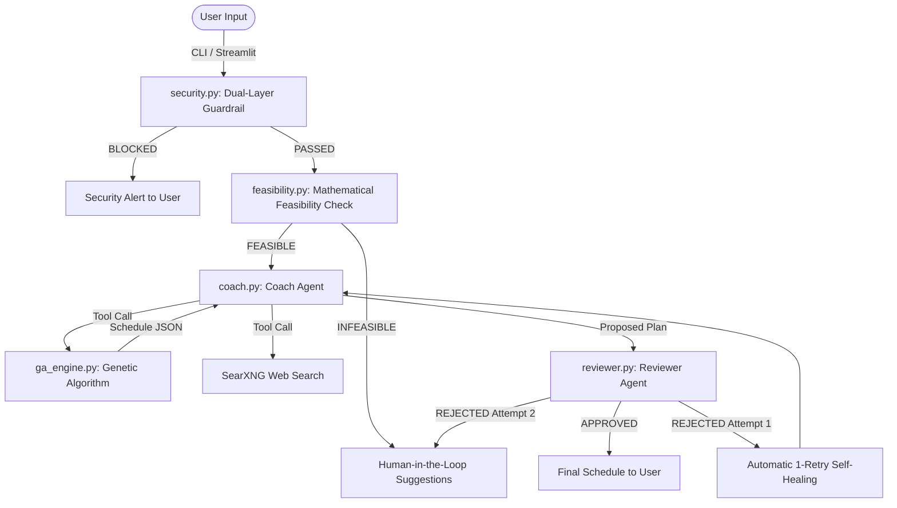
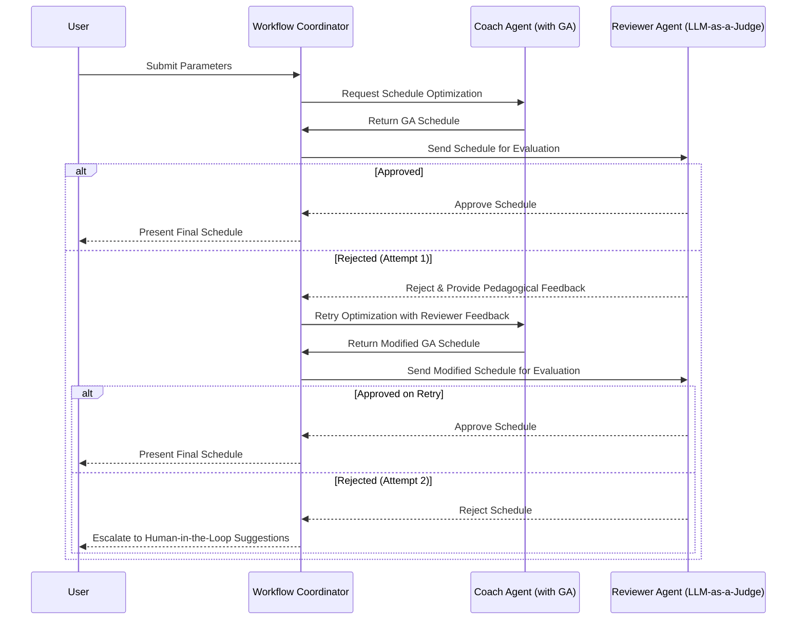

# An Autonomous Multi-Agent Framework for Personalized IELTS Study Schedule Optimization via Genetic Algorithms and Dual-Layer Security Guardrails

> **Track**: Agents for Good — Education  
> **Key Concepts**: Multi-Agent Orchestration · Model Context Protocol (MCP) · Genetic Algorithms · Cognitive Fatigue Modeling · Security Guardrails

---

## Abstract

This paper presents an autonomous, multi-agent pedagogical framework designed to optimize study schedules for the International English Language Testing System (IELTS). Preparing for the IELTS is a high-stakes, multi-dimensional challenge characterized by non-linear learning rates, cognitive fatigue dynamics, and discrete score rounding rules. Traditional static schedulers fail to resolve this complex combinatorial optimization problem. We propose a hybrid architecture that integrates a custom multi-objective Genetic Algorithm (GA) with an orchestrator of specialized Large Language Model (LLM) agents. The system enforces input safety through a dual-layer security guardrail (combining deterministic regular expressions and LLM semantic checks), performs mathematical pre-computation feasibility validation to prevent API latency and token waste, and employs a self-healing "LLM-as-a-Judge" feedback loop with human-in-the-loop escalation. Finally, the optimization engine is exposed via a Model Context Protocol (MCP) server for cross-platform integration. Simulation results across 100 heterogeneous student profiles demonstrate a 72.00% target success rate and an average overall band score improvement of +1.04 bands, validating the system's pedagogical soundness and optimization efficacy.

---

## 1. Introduction: Pedagogical Challenges in IELTS Preparation

Preparation for the International English Language Testing System (IELTS) is a critical endeavor for millions of candidates worldwide seeking academic or professional migration. The primary challenge lies in the allocation of scarce cognitive and temporal resources across four distinct language skills: Listening, Reading, Writing, and Speaking. Developing an effective study plan is a high-dimensional optimization problem governed by three critical human learning dynamics that conventional, static preparation platforms fail to accommodate:

1. **Nonlinear Learning Rates (Diminishing Returns)**: As proficiency approaches the maximum band of 9.0, the rate of improvement slows exponentially. Consequently, score gains at higher proficiency levels require substantially more study hours than at lower levels.
2. **Cognitive Fatigue & Task Alternation**: Consecutive sessions focusing on active productive skills (Writing, Speaking) induce high mental fatigue. Alternating between receptive (Listening, Reading) and productive skills mitigates fatigue and improves retention.
3. **Rounding Mechanics (Discrete Scaling)**: Because overall scores round to the nearest half-band (e.g., 6.25 rounds up to 6.5, but 6.125 rounds down to 6.0), strategic improvements in specific weak sub-scores yield disproportionate overall score increases.

Given these interacting variables, static, "one-size-fits-all" calendars cannot generate optimal schedules. Conversely, an autonomous agent-based framework can orchestrate mathematical optimization models, execute web searches for real-time pedagogical resources, evaluate proposed schedules against pedagogical criteria, and self-heal in response to critiques.

---

## 2. System Architecture and Multi-Agent Orchestration

The system implements a deterministic five-stage sequential pipeline orchestrated by a dedicated workflow coordinator (`workflow.py`). Rather than relying on chaotic, non-deterministic LLM-to-LLM routing, this structured design guarantees a predictable execution sequence, simplifies debugging, and manages API rate limits.



### 2.1 Component Breakdown

The architecture is modularly partitioned within the `ielts_coach/` Python package:

| Component | File | Description |
|:---|:---|:---|
| **Security Guardrail** | `agents/security.py` | Input validator (regex + semantic LLM). |
| **Feasibility Checker** | `feasibility.py` | Presets mathematical target validation. |
| **Coach Agent** | `agents/coach.py` | Schedules study via GA and web search. |
| **Reviewer Agent** | `agents/reviewer.py` | Critiques schedules as an LLM-as-a-Judge. |
| **Workflow Coordinator** | `workflow.py` | Orchestrates pipeline and retries. |
| **GA Engine** | `ga_engine.py` | Custom genetic algorithm engine. |
| **MCP Server** | `mcp_server.py` | Standard stdio tool protocol interface. |
| **Base Infrastructure** | `agents/base.py` | Adaptive model factory and retry wrapper. |
| **Mock Data** | `mock_data.py` | Evaluation scenarios for offline testing. |

### 2.2 Agent Framework: Agno

The agents are constructed using the Agno framework and powered by `gemini-2.5-flash`. An adaptive factory (`get_model()` in `base.py`) enables execution across three backends: Direct Gemini API (via `GEMINI_API_KEY`), LiteLLM Gateway (`LITELLM_BASE_URL` proxy), and an OpenAI fallback. To address potential API rate limits (HTTP 429/503), calls are managed through a retry wrapper with exponential backoff (2s $\rightarrow$ 4s $\rightarrow$ 8s).

---

## 3. Mathematical Modeling and Genetic Algorithm Optimization

To find the optimal balance between score improvement, cognitive fatigue, and study constraints, the scheduling task is formulated as a combinatorial optimization problem solved by a Genetic Algorithm (GA).

### 3.1 Chromosome Representation

A candidate solution (chromosome) is represented as a 7-day structure. Each day contains up to 4 study blocks. A single study block is encoded as a tuple:

$$\text{Block} = (s, t)$$

where $s \in \{\text{Listening}, \text{Reading}, \text{Writing}, \text{Speaking}\}$ represents the target skill, and $t \in [0.75, 2.0]$ hours denotes the duration of the study session.

### 3.2 Nonlinear Learning Curve Model

We model skill acquisition as an exponential saturation process, representing diminishing returns at higher proficiency levels:

$$P_s(t_s) = 9.0 - (9.0 - P_{s,0}) \cdot e^{-k_s \cdot t_s}$$

where $P_s(t_s)$ is the predicted score after $t_s$ total hours, $P_{s,0}$ is the baseline score, and $k_s$ is the skill-specific learning rate calibrated to reflect pedagogical difficulty: $k_{\text{Listening}} = 0.006$, $k_{\text{Reading}} = 0.005$, $k_{\text{Speaking}} = 0.004$, and $k_{\text{Writing}} = 0.003$.

### 3.3 Cognitive Fatigue Model

Daily cognitive fatigue $F_d$ is a power-law function of study duration, offset by a variety reward $\beta = 0.2$ for alternating skills to model task-switching recovery:

$$F_d = \sum_{j=1}^{m} (C_{\text{diff}} \cdot t_j^{1.3}) - 0.2 \cdot \sum_{j=2}^{m} \mathbb{1}[s_j \neq s_{j-1}]$$

where $m$ is the number of blocks on day $d$, $t_j$ is the duration of block $j$, and $C_{\text{diff}}$ is the skill difficulty coefficient ($C_{\text{Listening}} = 1.2$, $C_{\text{Reading}} = 1.3$, $C_{\text{Speaking}} = 1.4$, $C_{\text{Writing}} = 1.5$).

### 3.4 Multi-Objective Fitness Function

The GA optimizes a multi-objective fitness function containing fatigue and constraint penalties:

$$\text{Fitness} = \sum_{s \in \{L,R,W,S\}} P_s(t_s) - w_f \cdot \sum_{d=1}^{7} F_d - \sum_{c} \text{Penalty}_c$$

where $w_f$ scales the fatigue penalty, and $\text{Penalty}_c$ represents quadratic penalties for violating constraints (max 4 blocks/day, max 24 blocks/week, min 4 blocks/skill/week for balance).

### 3.5 Pre-computation Feasibility Validation

To prevent token waste, target feasibility is validated by inverting the learning curve equation to solve for the required study time ($T_{\text{req}}$):

$$T_{\text{req}} = \sum_{s \in \{L,R,W,S\}} \frac{1}{k_s} \ln\left(\frac{9.0 - P_{s,0}}{9.0 - \min(P_{s,\text{target}}, 8.9)}\right)$$

If $T_{\text{req}}$ exceeds available hours ($T_{\text{avail}} = \min(48, 7 \cdot H_{\text{max}}) \cdot \frac{D}{7}$, where $H_{\text{max}}$ is the daily limit and $D$ is preparation days), the pipeline halts and suggests mathematical adjustments, bypassing downstream models.

---

## 4. Dual-Layer Security Guardrails

To prevent prompt injection, jailbreaking, and out-of-domain instruction execution, the framework implements a dual-layer security guardrail system at the input gateway.

### 4.1 Layer 1: Rule-Based Filtering

This layer executes compiled regex checks in microseconds to intercept common jailbreak patterns (e.g., "ignore previous instructions", "DAN mode") and enforce minimum query length, filtering attacks with zero API latency.

### 4.2 Layer 2: LLM Semantic Filter

Valid inputs are analyzed by a lightweight `SecurityGuardrailAgent` to verify domain alignment with IELTS or English learning. The agent returns a structured JSON payload:

```json
{"is_safe": bool, "is_relevant": bool, "reason": str}
```

If either layer flags an input, the pipeline halts immediately and returns a security alert, blocking downstream execution.

---

## 5. Rejection Recovery and Human-in-the-Loop Integration

Pedagogically unsound schedules (e.g., sub-optimal ordering or fatigue distribution) trigger an automated self-healing loop and a human-in-the-loop fallback.



### 5.1 Self-Healing Loop

The `ReviewerAgent` acts as a pedagogical judge. If it rejects a plan:
1. The rejection feedback is captured.
2. The coordinator re-invokes `CoachAgent`, passing the feedback as context.
3. The GA optimizer runs again, incorporating these comments as soft constraints.

### 5.2 Human-in-the-Loop Escalation

If the second optimization is also rejected, the system escalates to the user. It presents the reviewer's critiques alongside mathematical parameters from the feasibility model (e.g., suggestions to extend duration or lower targets), allowing manual adjustment.

---

## 6. Model Context Protocol (MCP) Server Integration

The optimization engine is exposed as a Model Context Protocol (MCP) server using FastMCP. This enables external clients (e.g., Claude Desktop) to invoke the scheduler directly over stdio.

The tool signature is defined as follows:

```python
@mcp.tool()
def optimize_schedule_tool(
    current_scores: dict, target_scores: dict, days: int, max_daily_hours: float
) -> str:
    """Generates an optimized weekly study schedule via the GA engine."""
```

This decouples the business logic from user interfaces, facilitating external agentic integration.

---

## 7. Empirical Simulation Results and Validation

To validate the system, we evaluated 100 randomized student profiles (baseline 4.0 to 8.0, targets up to +1.5 bands, preparation 14 to 90 days) using `simulation.py`.

### 7.1 Optimization Metrics

| Performance Metric | Result |
|:---|:---|
| Target Success Rate | **72.00%** |
| Average Overall Band Score Improvement | **+1.04 bands** |
| Average Chromosome Fitness Score | **27.41** |

### 7.2 Convergence and Efficacy

- **Convergence**: The fitness distribution confirms consistent optimization without local minima trapping.
- **Improvement**: An average of +1.04 bands matches realistic pedagogical growth.
- **Fatigue Control**: Alternating schedules are consistently preferred, validating the fatigue model's effect.

---

## 8. Deployment Interfaces: Command Line and Web-Based Visualizer

The application provides two deployable frontends.

### 8.1 Streamlit Web Interface (`app.py`)

A custom dark-themed dashboard built with vanilla CSS featuring:
- **Parameters Sidebar**: Sliders for scores, duration, and maximum daily study hours.
- **Execution Timeline**: Live status badges tracking pipeline stages.
- **Charts & Logs**: Matplotlib plots for score trajectories and HTML expanders for trace logs.
- **Dual Modes**: *Live Mode* (requiring API keys) and *Demo Mode* (utilizing preloaded scenarios).

### 8.2 Command Line Interface (`cli.py`)

An interactive terminal app powered by the Rich library, enabling parameter configuration, tabular schedule printing, and trace log streaming.

### 8.3 Mock Scenario Simulator

Offline evaluation is supported via 5 mock scenarios:
1. **Success**: Standard pipeline completion.
2. **Infeasible**: Target interception and mathematical adjustment suggestion.
3. **Self-Healing**: Real-time optimization critique, GA re-run, and subsequent approval.
4. **Double Rejection**: Persistent optimization failure leading to HITL suggestions.
5. **Security Block**: Active detection and interception of malicious input.

---

## 9. Quality Assurance and Testing Suite

System stability and algorithm correctness are verified by a test suite of 24 cases managed via `pytest`.

| Test Module | Domain | Verification focus |
|:---|:---|:---|
| `test_ga.py` | GA Math | Validates learning, fatigue, and IELTS rounding. |
| `test_feasibility.py` | Feasibility | Verifies feasibility boundaries. |
| `test_agents.py` | Agents | Ensures correct model and tool registration. |
| `test_cli.py` | Interface | Checks CLI parsing and console formatting. |
| `test_integration.py` | Pipeline | Tests end-to-end retries and security blocks. |

All tests pass successfully under Python 3.12, confirming system resilience.

---

## 10. System Implementation Stack and Technologies

The framework's implementation stack comprises the following key components:

| Architectural Layer | Technology | Function |
|:---|:---|:---|
| **Agent Framework** | Agno (v2.6+) | Agent structure, routing, and tool integration. |
| **Inference Engine** | Gemini 2.5 Flash | Orchestration reasoning and review. |
| **Optimization Core** | Custom GA | Weekly schedule chromosome optimization. |
| **Web Search Skill** | SearXNG | Real-time query search for resources. |
| **Interoperability** | FastMCP (v1.28+) | Stdio transport for external tool usage. |
| **Web Dashboard** | Streamlit (v1.35+) | Dark-theme user interface and plots. |
| **CLI Console** | Rich (v13.7+) | Console logging, formatting, and tables. |
| **Math & Plots** | NumPy / Matplotlib | Numerical arrays and learning curves. |
| **Quality Suite** | Pytest (v9.1+) | Automated validation. |
